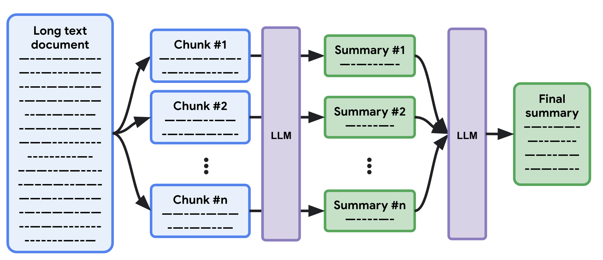

# Frequently Asked Questions

<!-- START doctoc generated TOC please keep comment here to allow auto update -->
<!-- DON'T EDIT THIS SECTION, INSTEAD RE-RUN doctoc TO UPDATE -->

- [How do I update Darwin?](#how-do-i-update-darwin)
- [How do I configure Darwin to work with a local LLM?](#how-do-i-configure-darwin-to-work-with-a-local-llm)
- [How do I configure Darwin to work with OpenAI?](#how-do-i-configure-darwin-to-work-with-openai)
- [How do I configure Darwin for paper summarization?](#how-do-i-configure-darwin-for-paper-summarization)
  - [Using OpenAI's API](#using-openais-api)
  - [Using a Local LLM](#using-a-local-llm)

<!-- END doctoc generated TOC please keep comment here to allow auto update -->

## How do I update Darwin?

Updating Darwin is straightforward. Execute the following command:

```bash
darwin update
```

This command will install the latest version of Darwin, ensuring you have the most up-to-date features and improvements available.

## How do I configure Darwin to work with a local LLM?

Darwin currently supports [Ollama](https://ollama.com/) as a local LLM provider. To configure Darwin to use Ollama:

1. Download and install [Ollama](https://ollama.com/).
2. Download a model you want to use. For example, to use the model `llama3:instruct`, run:

   ```sh
   ollama pull llama3:instruct
   ```

   A list of available models can be found [here](https://ollama.com/library).

   > Note: You should have at least 8 GB of RAM available to run the 7B models, 16 GB to run the 13B models, and 32 GB to run the 33B models.

3. Configure Darwin with the Ollama server's endpoint URL (typically `http://localhost:11434` unless Ollama is deployed to a remote server) and the model name _(the model from Step 2)_:

   ```bash
   darwin config set
   ```

4. Validate the configuration by running:

   ```bash
   darwin config get
   ```

## How do I configure Darwin to work with OpenAI?

To configure Darwin to use OpenAI's API, you first need to get an API key from OpenAI.

1. Sign up for an account on [OpenAI](https://platform.openai.com/signup) or [Sign in](https://platform.openai.com/login).
2. Navigate to the [API key page](https://platform.openai.com/account/api-keys) and "Create new secret key", optionally naming the key.
3. Copy the API key and configure Darwin with it:

   ```bash
   darwin config set
   ```

   Models available on OpenAI can be found [here](https://platform.openai.com/docs/models). Usually you can start with `gpt-3.5-turbo` which is a good compromise between cost and performance. If you want better result, you can try `gpt-4-turbo`.

4. Validate the configuration by running:

   ```bash
   darwin config get
   ```

## How do I configure Darwin for paper summarization?

Darwin uses a large language model (LLM) to summarize papers. You have two options: using OpenAI's API or setting up a local LLM.

### Using OpenAI's API

Configure OpenAI following the steps in the [previous section](#how-do-i-configure-darwin-to-work-with-openai).

Once you have configured Darwin to use OpenAI, you can summarize papers using OpenAI's cloud-based service by providing the flag `--llm openai`.

Example:

```bash
darwin search papers "flash attention" --log-level DEBUG --output ./darwin-data --count 3 --summary --llm openai
```

> Note: This method is the most performant but can be costly.

### Using a Local LLM

For a more economical approach, you can set up a local LLM like [Ollama](https://ollama.com/) by following the steps in the [previous section](#how-do-i-configure-darwin-to-work-with-a-local-llm).

Once you have configured Darwin to use Ollama, you can summarize papers using the local LLM by simply running the command or by explicitly providing the flag `--llm ollama`. _(This is the default provider if no provider is specified.)_

Example:

```bash
darwin search papers "flash attention" --log-level DEBUG --output ./darwin-data --count 3 --summary --llm ollama
```

## What are the different methods of summarization?

When summarizing long documents with LLMs (Large Language Models), the document is divided into chunks due to token limits. Each chunk is processed individually, and then these methods combine these processed chunks into a final summary.

Darwin supports two methods of summarization: `map_reduce` and `refine`.

### Map Reduce Method

The `map_reduce` method first summarizes each document independently in a **"map"** step. Afterward, it combines these individual summaries into a final summary in a **"reduce"** step.



**Pros:**

- Each document is summarized independently, ensuring a focused summary per document.
- Effective for documents with diverse content or where each section merits individual attention.

**Cons:**

- May not refine the summary iteratively, potentially missing nuances that could be captured through iterative refinement.
- Can be less effective for documents with a single central theme.

**When to Use:**

- Ideal for documents with varied topics or sections that require individual summarization before integration.

These methods enable Darwin to efficiently summarize large documents within the token constraints imposed by LLMs. However, the choice between `refine` and `map_reduce` depends on the nature of the document content and the desired focus of the summary.

### Refine Method

The `refine` method constructs the summary by iteratively updating its answer. It starts by creating a summary for the first chunk of the document. Then, it iteratively updates this summary by adding details from each subsequent chunk one by one, until the entire document is processed.

**Pros:**

- Iterative approach allows for continual improvement of the summary.
- Well-suited for documents with coherent themes and related content.

**Cons:**

- May get distracted by unrelated content within documents, potentially affecting the accuracy of the final summary.

  > For example, in a webpage document that discusses various topics including cookie preferences, the LLM may focus excessively on the cookie preferences rather than the main content of the document.

**When to Use:**

- Best suited for documents where the content is cohesive and focused, minimizing the risk of getting sidetracked.
